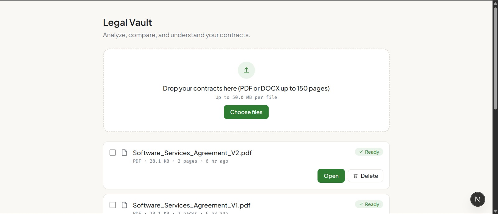
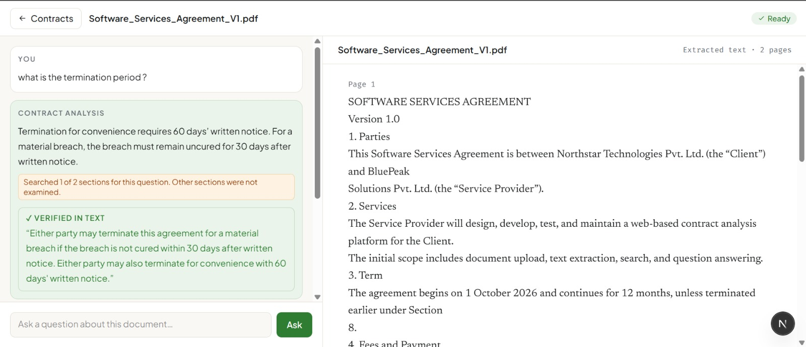
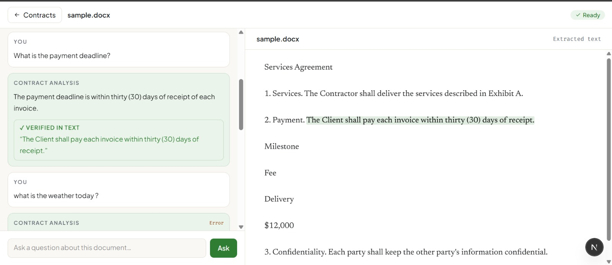
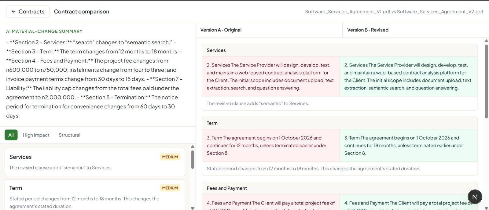

# Legal Vault

Legal Vault is an AI-powered web application for analyzing and comparing PDF and DOCX contracts.

Users can upload contracts, ask questions about their contents, view answers with independently verified quotes, navigate to highlighted citations, analyze multiple documents together, and compare two contract versions at the clause level.

## Main Screens

### Upload and Document Library



### Chat with Verified Quotes



### Citation Highlighting



### Document Comparison



## Run Locally

### Requirements

- Node.js 20.9 or newer
- npm
- A MongoDB database (MongoDB Atlas or a compatible MongoDB deployment)
- An OpenAI-compatible API endpoint and API key for AI features


### Setup

1. Install dependencies:

	```bash
	npm install
	```

2. Create `.env.local` in the project root:

	```dotenv
	MONGODB_URI=mongodb+srv://<username>:<password>@<cluster>/<database>
	MONGODB_DB=contract_analyser

	AI_API_KEY=<your-api-key>
	AI_BASE_URL=https://api.openai.com/v1
	AI_MODEL=gpt-6-luna

	MAX_UPLOAD_MB=50
	MAX_PAGES=150
	```

	`MONGODB_URI`, `AI_API_KEY`, `AI_BASE_URL`, and `AI_MODEL` are required. `MONGODB_DB`, `MAX_UPLOAD_MB`, and `MAX_PAGES` have defaults. `AI_MODEL` remains configurable; use a model available to your configured provider.

3. Start the development server:

	```bash
	npm run dev
	```

4. Open [http://localhost:3000](http://localhost:3000).

### Useful Commands

```bash
npm test       # Run the Vitest suite
npm run lint   # Run ESLint
npm run build  # Build for production
npm start      # Serve the production build
```

## Feature Status

### Part A: Complete

- PDF/DOCX upload and document library
- Text extraction and processing status
- Large-document retrieval (up to 150 pages)
- Single-document contract chat with streaming
- Saved per-document chat history
- Independently verified quotes
- Citation navigation and highlighting

### Part B: Complete

- Multi-document question answering
- Source-specific verified citations
- Clause-level contract comparison
- Added, removed, modified, and unchanged clause detection
- Significance classification of changes

### Part C — Not Implemented

No Part C feature was implemented.

### Not Included

- Authentication and user accounts
- OCR for scanned-only documents
- Word tracked-change redlining
- Agentic external document research
- Production audit logging
